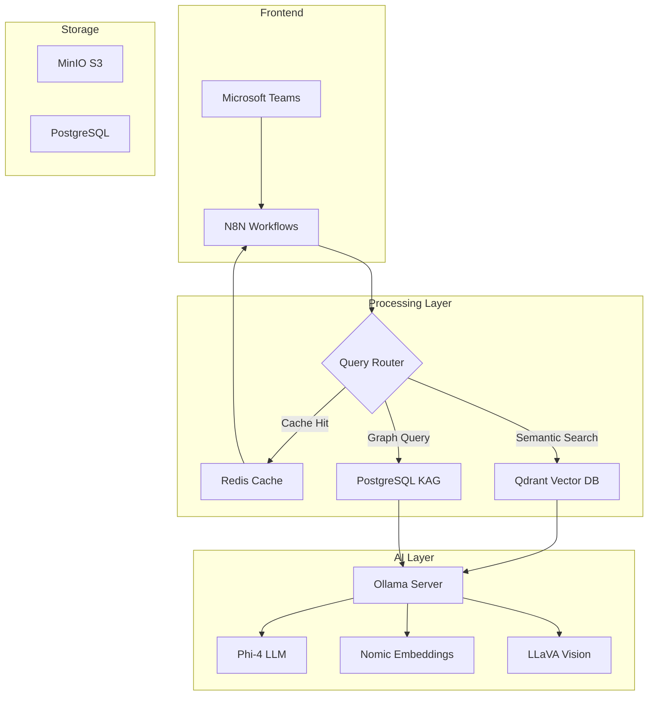

# DataLive RAG System

<div align="center">


**Sistema RAG Híbrido Multi-modal con N8N** 

[Documentación](#-documentación) • [Instalación](#-instalación-rápida) • [Arquitectura](#-arquitectura) • [Contribuir](#-contribuir)

</div>

---

## 📖 Descripción

DataLive es un sistema de Retrieval-Augmented Generation (RAG) de última generación que combina:

- 🤖 **RAG Multi-modal**: Procesamiento de texto e imágenes con embeddings especializados
- 🔄 **Arquitectura Híbrida**: RAG + CAG (Cache) + KAG (Knowledge Graph)
- 🎯 **N8N como Código**: Automatización completa con GitOps
- 🔒 **Seguridad First**: Docker Secrets y mejores prácticas 2025
- 📊 **Observabilidad Total**: Prometheus, Grafana, Loki

## 🚀 Instalación Rápida

### Requisitos Previos

- Docker 24.0+
- Docker Compose 2.20+
- 16GB RAM mínimo
- 50GB espacio en disco
- Ubuntu 22.04+ / Windows 11 con WSL2

### Setup Ultra-Rápido (Recomendado) 🎯

```bash
# 1. Clonar el repositorio
git clone https://github.com/tuusuario/datalive.git
cd datalive

# 2. Generar configuración automática (¡NUEVO!)
./scripts/generate-env.sh

# 3. Ejecutar setup completo
docker-compose up -d
```

**¡Solo 3 comandos!** El nuevo generador automatiza:
- 🔐 **Contraseñas seguras**: Auto-generadas (elimina riesgos de seguridad)
- 🌍 **Detección del sistema**: Zona horaria, puertos disponibles
- 👤 **Setup mínimo**: Solo email y nombre del administrador
- ⚡ **Configuración inteligente**: 15 variables automatizadas

### Setup Tradicional (Manual)

```bash
# 1. Clonar el repositorio
git clone https://github.com/tuusuario/datalive.git
cd datalive

# 2. Copiar y configurar el archivo de entorno
cp .env.example .env
# Editar .env con tus datos (especialmente N8N_USER_EMAIL, passwords, etc.)

# 3. Ejecutar setup completo
docker-compose up -d
```

¡Ambos métodos automatizan completamente:
- ✅ Configuración de N8N (usuario, licencia, credenciales)
- ✅ Descarga de modelos Ollama
- ✅ Creación de buckets MinIO
- ✅ Inicialización de colecciones Qdrant
- ✅ Importación de workflows
- ✅ Certificados SSL para Safari

### Setup Manual

<details>
<summary>Ver instrucciones manuales</summary>

```bash
# 1. Crear directorios
mkdir -p secrets config logs

# 2. Generar secretos
openssl rand -base64 32 > secrets/postgres_password.txt
openssl rand -base64 32 > secrets/minio_secret_key.txt
openssl rand -base64 32 > secrets/n8n_encryption_key.txt
openssl rand -base64 32 > secrets/grafana_password.txt

# 3. Iniciar servicios
docker-compose -f docker/docker-compose.yml up -d

# 4. Inicializar componentes individualmente
./scripts/init-ollama-models.sh
./scripts/init-minio-buckets.sh
./scripts/init-n8n-setup.sh
./scripts/init-qdrant-collections.sh
```

</details>

## 🏗️ Arquitectura

### Componentes Principales



### Flujos de Trabajo

#### 1. **Agente Archivista** (Ingesta)
- Monitorea cambios en Google Drive/SharePoint
- Procesa documentos multi-formato
- Genera embeddings especializados
- Almacena en Qdrant + MinIO

#### 2. **Agente Experto** (Consulta)
- Clasifica intención con LLM
- Enruta a CAG/RAG/KAG
- Genera respuestas contextuales
- Gestiona caché inteligente

#### 3. **Agente Optimizador** (Auto-mejora)
- Analiza patrones de uso
- Pre-calcula respuestas frecuentes
- Ajusta parámetros dinámicamente

## 📁 Estructura del Proyecto

```
datalive/
├── .github/workflows/      # CI/CD con GitHub Actions
├── docker/                 # Configuración Docker
│   ├── docker-compose.yml
│   └── docker-compose.prod.yml
├── workflows/              # Workflows N8N (JSON)
│   ├── ingestion/
│   ├── query/
│   └── optimization/
├── scripts/                # Scripts de automatización
│   ├── setup-datalive.sh
│   ├── init-*.sh
│   └── backup-*.sh
├── config/                 # Configuraciones
│   ├── n8n/
│   ├── prometheus/
│   └── grafana/
├── secrets/                # Secretos (no versionados)
└── .env.example           # Plantilla de configuración
```

## 🔧 Configuración

### 🎯 Configuración Automática (Recomendada)

```bash
# Generar configuración completa automáticamente
./scripts/generate-env.sh
```

El script detecta y configura automáticamente:
- 🔐 **15 contraseñas seguras** (elimina riesgos de seguridad)
- 🌍 **Zona horaria del sistema**
- 🔌 **Puertos disponibles**
- 🔑 **Claves de cifrado únicas**

### 📋 Variables de Entorno Principales

```bash
# Usuario administrador (único input requerido)
N8N_USER_EMAIL=tu@email.com
N8N_USER_FIRSTNAME=TuNombre
N8N_USER_LASTNAME=TuApellido

# Modelos AI (preconfigurados)
OLLAMA_EMBEDDING_MODEL=nomic-embed-text:v1.5
OLLAMA_ROUTER_MODEL=phi3:medium

# Puertos (detectados automáticamente)
DATALIVE_AGENT_PORT=8058
```

Ver `docs/ENV_CONF_README.md` para documentación completa de variables.

## 📊 Monitoreo

### Dashboards Disponibles

- **System Overview**: http://localhost:3000/d/system
- **RAG Performance**: http://localhost:3000/d/rag
- **Query Analytics**: http://localhost:3000/d/queries

### Métricas Clave

- Latencia P95 de queries
- Hit rate de caché
- Tiempo de embedding
- Uso de recursos por servicio

## 🛠️ Mantenimiento

### Comandos Útiles

```bash
# Ver logs de un servicio
docker-compose -f docker/docker-compose.yml logs -f n8n

# Backup completo
./scripts/backup-all.sh

# Actualizar workflows desde Git
./scripts/sync-n8n-workflows.sh

# Verificar salud del sistema
./scripts/health-check.sh
```

### Actualización de Modelos

```bash
# Actualizar modelos Ollama
docker exec -it datalive-ollama ollama pull phi-4:latest

# Listar modelos instalados
docker exec -it datalive-ollama ollama list
```

## 🔐 Seguridad

- ✅ Secretos gestionados con Docker Secrets
- ✅ Usuarios no-root en contenedores
- ✅ Redes segmentadas (frontend/backend/monitoring)
- ✅ Backup automático con retención configurable
- ✅ Rate limiting y circuit breakers

## 🤝 Contribuir

1. Fork el proyecto
2. Crea tu rama (`git checkout -b feature/AmazingFeature`)
3. Commit cambios (`git commit -m 'Add AmazingFeature'`)
4. Push a la rama (`git push origin feature/AmazingFeature`)
5. Abre un Pull Request

## 📝 Licencia

Distribuido bajo la licencia MIT. Ver `LICENSE` para más información.
